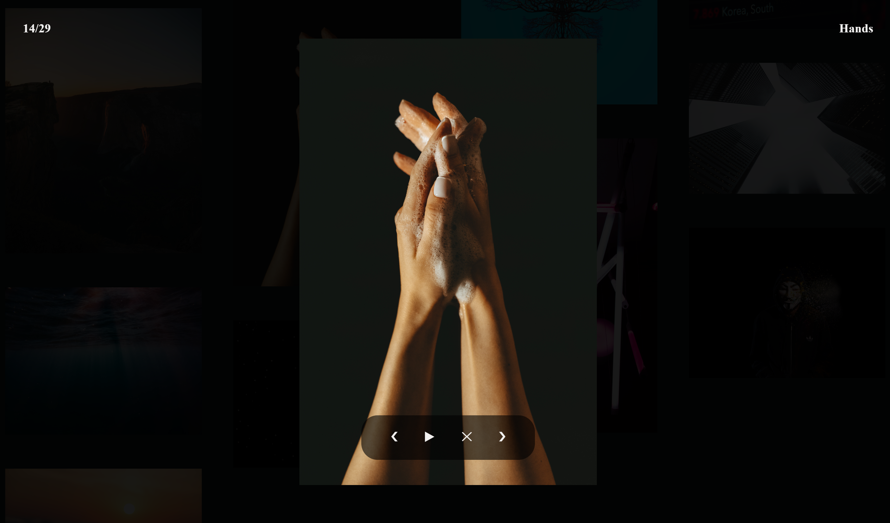

# Ng-Opengallery

Opengallery is an Angular library component for efficient gallery rendering and interactions (images & videos). The gallery layout is responsive for all devices and loads the content only if it's in the viewport. A media viewer is shipped and included with this library. You can configure the component the way you want. This project was generated with [Angular CLI](https://github.com/angular/angular-cli) version 9.

# NPM

You can integrate opengallery in your project using `npm i ng-opengallery --save`. For more documentation about opengallery check out the readme in the projects/opengallery folder or directly on the npm opengallery page https://www.npmjs.com/package/ng-opengallery.

# Demo Opengallery

### Simple layout (default)

### Catalog layout (netflix like)

### Carousel layout

### Masonry layout

### Media viewer (diaporama support)

### Try it out
Try it out here: [DEMO](https://rloris.github.io/lib-ng-opengallery/) or clone this repo and run `ng serve` for a dev server. Navigate to `http://localhost:4200/`. The app will automatically reload if you change any of the source files. You can then test the opengallery library demo.

# License

This project is under the MIT license.

# Author(s)

[RLoris](https://github.com/RLoris)